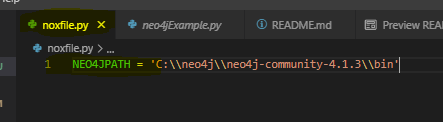

# masterseminar

Willkommen zum Tutorial des Masterseminars für Neo4j. Dies
ist der Haupteinstiegspunkt zum Tutorial zum Einrichten und Arbeiten mit
Neo4j in Windows 10 64 Bit.

**@author**: Leander Féret

## Neo4j Nutzer und Passwort dieses Tutorials

Nutzer: ```neo4j```
Passwort: ```neo4j```

# Installiere Python3

Für dieses Tutorial wurde Python3 in der Version 3.9 verwendet. Sollte diese nicht bereits auf
dem System so vorhanden sein, dass es über Python in der Shell erreicht wird, sollte bitte folgendem Tutorial
zur Installation gefolgt werden:

[Install Guide - Python3 für Windows 10 64 Bit](tutorial/Installation-python3-win10b64.pdf)

# Virtual Environment erstellen und aktivieren

Installiere das Paket **virtualenv** für Ihre Python-Installation:

```bash
pip install virtualenv
```

Navigieren Sie im Terminal in das Projectverzeichnis dieses Tutorials über

```bash
cd C:\\Path\\to\\this\\project\\directory
```

Erstellen Sie eine virtuelle Umgebung.

```bash
python -m virtualenv .venv
```

Aktivieren Sie die virtuelle Umgebung.

```bash
.\.venv\Scripts\activate
```

Installieren Sie die verwendeten Pakete dieses Tutorials über

```bash
pip install -r requirements.txt
```

Nachfolgend wird immer davon ausgegangen, dass Sie python-Befehle in einem Terminal mit
dieser aktivierten virtuellen Umgebung ausführen.

# Installiere Neo4j Community Edition und OpenJdk 15

Für dieses Tutorial muss Neo4j Community und OpenJdk installiert sein. Hierfür sollte dem
nachfolgenden PDF-gefolgt werden.

[Install Guide - Neo4j Community und OpenJdk](tutorial/Installation-neo4j-communityServer-windows10.pdf)

**Achtung!** Beachten Sie, dass sich neo4j.exe auch wirklich unter C:\neo4j\neo4j-community-4.1.3\bin
befindet, wie in dem Install Guide beschrieben. Wenn Sie einen anderen Pfad verwenden, müssen Sie in der folgenden
Datei den Pfad zu Ihrem abändern.

[noxfile.py - Script Sammlung](noxfile.py)



Stimmt der Pfad mit Ihrem überein, so können Sie Neo4j auch mit Hilfe der Scriptsammlung dieses Tutorials starten:

```bash
nox -s neo4j
```

# Neo4j Web

Machen Sie sich mit Neo4js Weboberfläche vertraut, indem Sie folgendem Tutorial folgen.
Anschließend wird mit dem Ergebnis über Python weitergearbeitet.

[Erste Schritte - Neo4j Web](tutorial/Erste-Schritte-im-neo4j-Browser.pdf)

# Neo4j Python

Machen Sie sich mit dem Python Neo4j-Treiber vertraut, indem Sie folgendem Tutorial folgen. Anschließend wird mit dem Ergebnis über Python weiter gearbeitet.

[Erste Schritte - Neo4j Python](tutorial/Erste-Schritte-mit-neo4j-for-Python.pdf)

# Simple Fraud-Detection Beispiel

In diesem Abschnitt wird das Beispiel ```Simple Fraud-Detection``` durchgearbeitet. Hierzu müssen den folgenden Schritten gefolgt werden.
Es wird davon ausgegangen, dass die obigen Schritte zur Initialisierung des Projektes durchgeführt wurden!


## 01. Aktivieren der Virtuellen Umgebung

Wenn noch nicht aktiviert, muss die Virtuelle Umgebung aktiviert werden!

```bash
.\.venv\Scripts\activate
```

## 02. Starten des Neo4j-Server-Community

Sobald die Virtuelle Umgebung aktiviert ist, kann der Neo4j-Server-Community über folgenden Befehl gestartet werden:

```bash
nox -s neo4j
```

Wenn hierbei Probleme Auftreten, ist etwas an der Konfiguration des Projektes nicht korrekt und es sollten alle obigen Schritte
erneut geprüft werden. Vor allem auf die korrekten Pfade sollte geachtet werden. Und potentielle Anpassungen, die notwendig sind,
wenn nicht mit Windows 10 sondern zum Beispiel Linux gearbeitet wird.

## 03. Leeren der Neo4j Datenabnk Instanz

Da Neo4j-Server-Community nur eine Datenbank anbietet (mehrere sind über Enterprise oder Nutzung von zum Beispiel Docker möglich),
sollte diese auf jeden Fall über folgenden Cypher Befehl im Neo4j Browser gestartet werden. Der Browser ist über folgenden Link zu erreichen:

```http://localhost:7474/```

```'MATCH (n) DETACH DELETE n'```

## 04. Simple Fraud Detection Aufgabe

Die Aufgaben befinden sich unter dem Ordner

```src\Simple_Fraud_Detection\to_complete```

Hier befinden sich drei Python Scripts.

* 01_fill_fraud_db_with_nodes.py
* 02_add_relationships_to_nodes.py
* 03_find_fraud_anomaly.py

Hierbei müssen aber nur Datei 01 und Datei 02 angepasst werden.

## 01_fill_fraud_db_with_nodes.py

Öffne die Datei 01 und schreibe den Cypher-Befehl über korrekten Python-Code an der über 
das ```TODO``` gekennzeichnete Stelle.

Eine mögliche Lösung ist hier gegeben.

```src\Simple_Fraud_Detection\solution\01_fill_fraud_db_with_nodes.py```

Getestet kann die Datei einfach über das Aufrufen über ```python``` im Terminal,
oder aber über den folgenden Nox-Befehl

```nox -s fraud_ex_1```

Ebenso sollte das Ergebnis im Neo4j Browser geprüft werden. Vergleichsbild ist unter

```src\Simple_Fraud_Detection\solution\01\Node Creations.PNG```

zu finden.

## 02_add_relationships_to_nodes.py

Öffne die Datei 01 und schreibe den Cypher-Befehl über korrekten Python-Code an der über 
das ```TODO``` gekennzeichnete Stelle.

Eine mögliche Lösung ist hier gegeben.

```src\Simple_Fraud_Detection\solution\02_add_relationships_to_nodes.py```

Getestet kann die Datei einfach über das Aufrufen über ```python``` im Terminal,
oder aber über den folgenden Nox-Befehl

```nox -s fraud_ex_2```

Ebenso sollte das Ergebnis im Neo4j Browser geprüft werden. Vergleichsbild ist unter

```src\Simple_Fraud_Detection\solution\02\Relationship Creation.PNG```

zu finden.

## 03_find_fraud_anomaly.py

Starte zur Überprüfung die Fraud_Anomaly Erkennung über python im Terminal oder über nox

```nox -s fraud_ex_3```


Wurde alles korrekt ausgeführt, dürfte die diese Datei das korrekte Ergebnis ausliefern.


Hierbei kann auch der folgende Befehl manuell im Neo4j-Browser eingegeben werden

```
MATCH       (person:Person)-[]->(contactInformation)
WITH        contactInformation,
            count(person) AS RingSize
MATCH       (contactInformation)<-[]-(person)
WITH        collect(person.name) AS persons,
            contactInformation, RingSize
WHERE       RingSize > 1
RETURN      persons AS FraudRing,
            labels(contactInformation) AS ContactType,
            RingSize
ORDER BY    RingSize DESC 
```

Vergleichsbild ist unter

```src\Simple_Fraud_Detection\solution\03\Fraud Ring Sizes.PNG```

zu finden.
